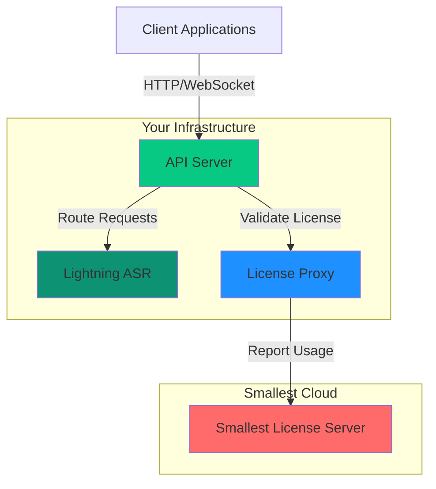
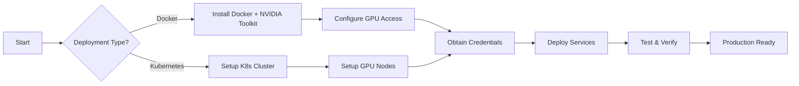

## What is Smallest Self-Host?

Smallest Self-Host enables you to deploy state-of-the-art speech-to-text (STT) models in your own infrastructure, whether in the cloud or on-premises. Built for enterprises with stringent performance, security, or compliance requirements, it provides the same powerful AI capabilities as Smallest's cloud service while keeping your data under your complete control.

## Why Self-Host?

Using Smallest as a managed service has many benefits: it's fast to start developing with, requires no infrastructure setup, and eliminates all hardware, installation, configuration, backup, and maintenance-related costs. However, there are situations where a self-hosted deployment makes more sense.

### Performance Requirements

Certain use cases have very sensitive latency and load requirements. If you need ultra-low latency with voice AI services colocated with your other services, self-hosting can meet these requirements.

**Ideal for:**

- **Real-time AI voicebots** requiring &lt;100ms response times
- **Live transcription systems** for broadcasts or conferences
- **High-volume processing** with predictable costs
- **Edge deployments** with limited internet connectivity

**Benefits:**

- Colocate speech services with your application infrastructure
- Scale independently based on your specific workload patterns
- No network latency to external APIs
- Consistent performance regardless of internet conditions

### Security & Data Privacy

One of the most common use cases for self-hosting Smallest is to satisfy security or data privacy requirements. In a typical self-hosted deployment, no audio, transcripts, or other identifying markers of the request content are sent to Smallest servers.

**Ideal for:**

- **Healthcare applications** requiring HIPAA compliance
- **Financial services** with strict data governance
- **Government and defense** applications
- **Enterprise environments** with air-gapped networks

**Data Privacy:**

- Your audio data never leaves your infrastructure
- Transcripts remain entirely within your control
- No data stored beyond the duration of the API request
- Self-hosted deployments do not persist request/response data

**What is reported:**

- Only metadata such as audio duration, character count, features requested, and success response codes
- No audio content, transcripts, or personally identifiable information

<Note>
  In a typical self-hosted deployment, no audio or transcript data is sent to
  Smallest servers. Only usage metadata (duration, feature flags, response
  codes) is reported to the license server for validation and billing purposes.
</Note>

### Cost Optimization

For high-volume or predictable workloads, self-hosting can be more cost-effective:

- **Predictable costs** based on infrastructure, not usage
- **No per-minute charges** for audio processing
- **Efficient resource utilization** with autoscaling
- **Long-term savings** for sustained high volumes

### Customization & Control

Self-hosting provides complete control over your deployment:

- **Custom resource allocation** optimized for your workload
- **Version control** - upgrade on your schedule
- **Network isolation** - deploy in private networks
- **Integration flexibility** - direct database access, custom monitoring

## Components

Before you deploy Smallest, you'll need to understand the components of your system, their relationships, and the interactions between components. A well-designed architecture will meet your business needs, optimize both performance and security, and provide a strong technical foundation for future growth.

### Architecture Diagram

### Component Details

<AccordionGroup>
  <Accordion title="API Server" icon="server">
    **Purpose:** The API server interfaces with Lightning ASR to expose endpoints for your requests.
    
    **Key Features:**
    - Routes incoming API requests to available Lightning ASR workers
    - Manages WebSocket connections for streaming transcription
    - Handles request queuing and load balancing across workers
    - Provides unified REST API interface
    
    **Resource Requirements:**
    - CPU: 0.5-2 cores
    - Memory: 512 MB - 2 GB
    - No GPU required
  </Accordion>

{" "}

<Accordion title="Lightning ASR" icon="bolt">
  **Purpose:** The Lightning ASR engine performs the computationally intensive
  task of speech recognition. It manages GPU devices and responds to requests
  from the API layer. **Key Features:** - GPU-accelerated speech recognition
  (0.05-0.15x real-time factor) - Real-time and batch audio transcription -
  Automatic model loading and optimization - Horizontal scaling support
  **Resource Requirements:** - CPU: 4-8 cores - Memory: 12-16 GB RAM - **GPU: 1x
  NVIDIA GPU (16+ GB VRAM required)** - Storage: 50+ GB for models **Note:**
  Because Lightning ASR is decoupled from the API Server, you can scale it
  independently based on your transcription load.
</Accordion>

{" "}

<Accordion title="License Proxy" icon="key">
  **Purpose:** Components register with the Smallest License Server to verify
  licensing and report usage. API and Engine containers can be configured to
  connect directly to the licensing server, or to proxy their communication
  through the License Proxy. **Key Features:** - License key validation on
  startup - Usage metadata reporting (no audio/transcript data) - Grace period
  support for offline operation - Secure communication with Smallest License
  Server **Resource Requirements:** - CPU: 0.25-1 core - Memory: 256-512 MB - No
  GPU required **Network:** Requires outbound HTTPS to
  `https://console-api.smallest.ai`
</Accordion>

  <Accordion title="Redis" icon="database">
    **Purpose:** Provides caching and state management for the system.
    
    **Key Features:**
    - Request queuing and coordination between API and ASR workers
    - Session state for streaming connections
    - Performance optimization through caching
    - Can be embedded or external (AWS ElastiCache, etc.)
    
    **Resource Requirements:**
    - CPU: 0.5-1 core
    - Memory: 512 MB - 2 GB
    - No GPU required
  </Accordion>
</AccordionGroup>

## Common Setup Path

All deployments follow the same initial setup path through environment preparation. Here's what to expect:

### 1. Choose Your Deployment Method

<CardGroup cols={2}>
  <Card title="Docker/Podman" icon="docker">
    **Best for:** Development, testing, small-scale production
    
    **Timeline:** 15-30 minutes
    
    **Complexity:** Low
  </Card>

  <Card title="Kubernetes" icon="dharmachakra">
    **Best for:** Production deployments with autoscaling
    
    **Timeline:** 1-2 hours
    
    **Complexity:** Medium-High
  </Card>
</CardGroup>

### 2. Prepare Infrastructure

**Steps:**

1. **Obtain credentials** from Smallest.ai (license key, registry access, model URLs)
2. **Prepare infrastructure** (Docker host or Kubernetes cluster)
3. **Setup GPU support** (NVIDIA drivers, device plugins)
4. **Deploy components** (API Server, Lightning ASR, License Proxy, Redis)
5. **Configure autoscaling** (optional, Kubernetes only)
6. **Setup monitoring** (optional, Prometheus & Grafana)

### What You'll Need

Before starting, ensure you have:

<CardGroup cols={2}>
  <Card title="From Smallest.ai" icon="key">
    - License key
    - Container registry credentials
    - Model download URLs
    
    Contact: **support@smallest.ai**
  </Card>

  <Card title="Technical Requirements" icon="server">
    - GPU infrastructure (NVIDIA A10, T4, or better)
    - Kubernetes cluster or Docker host
    - Basic DevOps knowledge
    - Network connectivity for license validation
  </Card>
</CardGroup>

## Deployment Options

Smallest Self-Host supports two primary deployment methods, each suited for different operational requirements:

<CardGroup cols={2}>
      <Card title="Docker Deployment" icon="docker" href="/docker/stt/quick-start">
    Best for development, testing, or small-scale production deployments
    
    **Pros:**
    - Fastest setup (under 15 minutes)
    - Minimal infrastructure requirements
    - Single-machine deployment
    - Easy configuration with docker-compose
    
    **Use Cases:**
    - Development and testing
    - Proof of concept
    - Small-scale production
    - Edge deployments
  </Card>

  <Card title="Kubernetes Deployment" icon="dharmachakra" href="/kubernetes/quick-start">
    Production-grade deployment with enterprise features
    
    <Warning>
    **Available for ASR only.** TTS Kubernetes support coming soon.
    </Warning>
    
    **Pros:**
    - Auto-scaling based on load
    - High availability and fault tolerance
    - Advanced monitoring with Grafana
    - Shared model storage
    
    **Use Cases:**
    - Production workloads
    - High-traffic applications
    - Multi-region deployments
    - Enterprise infrastructure
  </Card>
</CardGroup>

## Prerequisites

Before deploying Smallest Self-Host, ensure you have:

<Steps>
  <Step title="License Key">
    Contact **support@smallest.ai** or your Smallest representative to obtain:
    - License key for validation
    - Container registry credentials
  </Step>

<Step title="Infrastructure">
  Provision compute resources: - **For Docker**: Single machine with NVIDIA GPU
  - **For Kubernetes**: Cluster with GPU node pool
</Step>

  <Step title="GPU Drivers">
    Install NVIDIA drivers and container runtime:
    - NVIDIA Driver 525+ (for A10, A100, L4)
    - NVIDIA Driver 470+ (for T4, V100)
    - NVIDIA Container Toolkit
  </Step>
</Steps>

## What's Next?

Choose your deployment path based on your needs:

### For Quick Start & Testing

<Card title="Start with Docker" icon="docker" href="/docker/stt/prerequisites">
  **Fastest path to get running** (15-30 minutes) Perfect if you're: -
  Evaluating Smallest Self-Host for the first time - Building a proof-of-concept
  - Setting up a development environment - Running on a single GPU server [Go to
  Docker Setup →](/docker/stt/prerequisites)
</Card>

### For Production Deployment

<CardGroup cols={2}>
  <Card title="Kubernetes on AWS" icon="aws" href="/kubernetes/aws/eks-setup">
    **Full-featured production setup**
    
    - Auto-scaling (HPA + Cluster Autoscaler)
    - High availability across zones
    - Grafana monitoring dashboards
    - Shared model storage with EFS
    
    [Setup AWS EKS →](/kubernetes/aws/eks-setup)
  </Card>

  <Card title="Kubernetes (Generic)" icon="dharmachakra" href="/kubernetes/prerequisites">
    **For any Kubernetes cluster**
    
    - Works on GCP, Azure, on-prem
    - Full autoscaling support
    - Advanced monitoring
    - Production-ready
    
    [Setup Kubernetes →](/kubernetes/prerequisites)
  </Card>
</CardGroup>

### Quick Links by Role

<AccordionGroup>
  <Accordion title="I'm a DevOps Engineer" icon="terminal">
    Start here:
    1. [Kubernetes Prerequisites](/kubernetes/prerequisites) - Check cluster requirements
    2. [AWS EKS Setup](/kubernetes/aws/eks-setup) - Create EKS cluster (if on AWS)
    3. [Quick Start](/kubernetes/quick-start) - Deploy with Helm
    4. [Autoscaling](/kubernetes/autoscaling/hpa-configuration) - Configure HPA
    5. [Monitoring](/kubernetes/autoscaling/grafana-dashboards) - Setup Grafana
  </Accordion>

{" "}

<Accordion title="I'm a Developer" icon="code">
  Start here: 1. [Docker Prerequisites](/docker/prerequisites) - Setup local
  environment 2. [Docker Quick Start](/docker/stt/quick-start) - Get running in
  15 minutes 3. [API Reference](/api-reference/authentication) - Integrate with
  your app 4. [Examples](/api-reference/examples) - See code examples
</Accordion>

{" "}

<Accordion title="I'm Evaluating the Product" icon="magnifying-glass">
  Start here: 1. [Docker Quick Start](/docker/stt/quick-start) - Fastest way to
  test 2. [API Reference](/api-reference/endpoints/transcription) - See what you
  can do 3. [Common Issues](/troubleshooting/common-issues) - Get help if stuck
  4. Then move to [Kubernetes](/kubernetes/quick-start) for production
</Accordion>

  <Accordion title="I Need Help" icon="life-ring">
    Resources:
    - [Common Issues](/troubleshooting/common-issues) - Quick fixes
    - [Debugging Guide](/troubleshooting/debugging-guide) - Advanced troubleshooting
    - [Logs Analysis](/troubleshooting/logs-analysis) - Interpret error messages
    - **Support:** support@smallest.ai
  </Accordion>
</AccordionGroup>

<Note>
  **Recommendation:** Start with Docker to familiarize yourself with the
  components and API. Once you're comfortable, move to Kubernetes for production
  deployments with autoscaling and high availability.
</Note>
