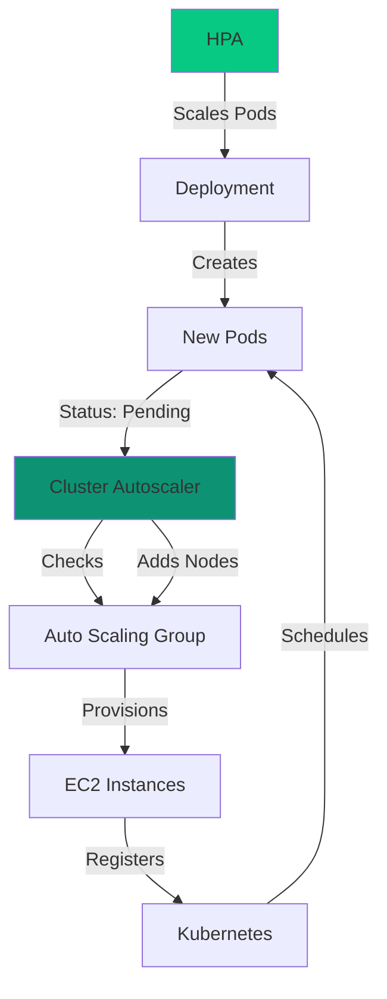

## Overview

The Cluster Autoscaler automatically adjusts the number of nodes in your EKS cluster based on pending pods and resource utilization. When combined with HPA, it provides end-to-end autoscaling from application load to infrastructure capacity.

## How It Works



**Flow**:
1. HPA scales pods based on metrics
2. New pods enter "Pending" state (insufficient resources)
3. Cluster Autoscaler detects pending pods
4. Adds nodes to Auto Scaling Group
5. Pods scheduled on new nodes
6. After scale-down period, removes underutilized nodes

## Prerequisites

<Steps>
  <Step title="IAM Role">
    Create IAM role with autoscaling permissions (see [IAM & IRSA](/kubernetes/aws/iam-irsa))
  </Step>

  <Step title="Node Group Tags">
    Ensure node groups have proper tags:
    
    ```
    k8s.io/cluster-autoscaler/<cluster-name>: owned
    k8s.io/cluster-autoscaler/enabled: true
    ```
  </Step>

  <Step title="Service Account">
    IRSA-enabled service account for Cluster Autoscaler
  </Step>
</Steps>

## Installation

### Using Helm Chart

The Smallest Self-Host chart includes Cluster Autoscaler as a dependency:

```yaml values.yaml
cluster-autoscaler:
  enabled: true
  rbac:
    serviceAccount:
      name: cluster-autoscaler
      annotations:
        eks.amazonaws.com/role-arn: arn:aws:iam::YOUR_ACCOUNT_ID:role/cluster-autoscaler-role
  autoDiscovery:
    clusterName: smallest-cluster
  awsRegion: us-east-1
  
  extraArgs:
    balance-similar-node-groups: true
    skip-nodes-with-system-pods: false
    scale-down-delay-after-add: 5m
    scale-down-unneeded-time: 10m
```

Deploy:

```bash
helm upgrade --install smallest-self-host smallest-self-host/smallest-self-host \
  -f values.yaml \
  --namespace smallest
```

### Standalone Installation

Install Cluster Autoscaler separately:

```bash
helm repo add autoscaler https://kubernetes.github.io/autoscaler
helm repo update

helm install cluster-autoscaler autoscaler/cluster-autoscaler \
  --namespace kube-system \
  --set autoDiscovery.clusterName=smallest-cluster \
  --set awsRegion=us-east-1 \
  --set rbac.serviceAccount.annotations."eks\.amazonaws\.com/role-arn"=arn:aws:iam::ACCOUNT_ID:role/cluster-autoscaler-role
```

## Configuration

### Auto-Discovery

Auto-discover Auto Scaling Groups by cluster name:

```yaml
autoDiscovery:
  clusterName: smallest-cluster
  tags:
    - k8s.io/cluster-autoscaler/enabled
    - k8s.io/cluster-autoscaler/smallest-cluster
```

### Manual Configuration

Explicitly specify Auto Scaling Groups:

```yaml
autoscalingGroups:
  - name: eks-cpu-nodes
    minSize: 1
    maxSize: 10
  - name: eks-gpu-nodes
    minSize: 0
    maxSize: 20
```

### Scale-Down Configuration

Control when and how nodes are removed:

```yaml
extraArgs:
  scale-down-enabled: true
  scale-down-delay-after-add: 10m
  scale-down-unneeded-time: 10m
  scale-down-utilization-threshold: 0.5
  max-graceful-termination-sec: 600
```

**Parameters**:
- `scale-down-delay-after-add`: Wait time after adding node before considering scale-down
- `scale-down-unneeded-time`: How long node must be underutilized before removal
- `scale-down-utilization-threshold`: CPU/memory threshold (0.5 = 50%)
- `max-graceful-termination-sec`: Max time for pod eviction

### Node Group Priorities

Scale specific node groups first:

```yaml
extraArgs:
  expander: priority
  
priorityConfigMapAnnotations:
  cluster-autoscaler.kubernetes.io/expander-priorities: |
    10:
      - .*-spot-.*
    50:
      - .*-ondemand-.*
```

Priorities:
- Higher number = higher priority
- Regex patterns match node group names
- Useful for preferring spot instances

## Verify Installation

### Check Cluster Autoscaler Pod

```bash
kubectl get pods -n kube-system -l app.kubernetes.io/name=aws-cluster-autoscaler
```

### Check Logs

```bash
kubectl logs -n kube-system -l app.kubernetes.io/name=aws-cluster-autoscaler -f
```

Look for:
```
Starting cluster autoscaler
Auto-discovery enabled
Discovered node groups: [eks-gpu-nodes, eks-cpu-nodes]
```

### Verify IAM Permissions

```bash
kubectl logs -n kube-system -l app.kubernetes.io/name=aws-cluster-autoscaler | grep -i "error\|permission"
```

Should show no permission errors.

## Testing Cluster Autoscaler

### Trigger Scale-Up

Create pods that exceed cluster capacity:

```bash
kubectl run test-scale-up-1 \
  --image=nginx \
  --requests='cpu=1,memory=1Gi' \
  --replicas=20 \
  --namespace=smallest
```

Watch nodes:

```bash
watch -n 5 'kubectl get nodes'
```

Watch Cluster Autoscaler:

```bash
kubectl logs -n kube-system -l app.kubernetes.io/name=aws-cluster-autoscaler -f
```

Expected behavior:
1. Pods enter "Pending" state
2. Cluster Autoscaler detects pending pods
3. Logs show: "Scale-up: setting group size to X"
4. New nodes appear in `kubectl get nodes`
5. Pods transition to "Running"

### Trigger Scale-Down

Delete test pods:

```bash
kubectl delete deployment test-scale-up-1 -n smallest
```

After `scale-down-unneeded-time` (default 10 minutes):
1. Cluster Autoscaler marks underutilized nodes
2. Drains pods gracefully
3. Terminates EC2 instances
4. Node count decreases

## GPU Node Scaling

### Configure GPU Node Groups

Tag GPU node groups for autoscaling:

```yaml cluster-config.yaml
managedNodeGroups:
  - name: gpu-nodes
    instanceType: g5.xlarge
    minSize: 0
    maxSize: 10
    desiredCapacity: 1
    tags:
      k8s.io/cluster-autoscaler/smallest-cluster: "owned"
      k8s.io/cluster-autoscaler/enabled: "true"
      k8s.io/cluster-autoscaler/node-template/label/workload: "gpu"
```

### Prevent Cluster Autoscaler on GPU Nodes

Run Cluster Autoscaler on CPU nodes to avoid wasting GPU:

```yaml values.yaml
cluster-autoscaler:
  nodeSelector:
    workload: cpu
  
  tolerations: []
```

### Scale to Zero

Allow GPU nodes to scale to zero during off-hours:

```yaml
managedNodeGroups:
  - name: gpu-nodes
    minSize: 0
    maxSize: 10
```

Cluster Autoscaler will:
- Add GPU nodes when Lightning ASR pods are pending
- Remove GPU nodes when all GPU workloads complete

<Note>
First startup after scale-to-zero takes longer (node provisioning + model download).
</Note>

## Spot Instance Integration

### Mixed Instance Groups

Use spot and on-demand instances:

```yaml cluster-config.yaml
managedNodeGroups:
  - name: gpu-nodes-mixed
    minSize: 1
    maxSize: 10
    instancesDistribution:
      onDemandBaseCapacity: 1
      onDemandPercentageAboveBaseCapacity: 20
      spotAllocationStrategy: capacity-optimized
    instanceTypes:
      - g5.xlarge
      - g5.2xlarge
      - g4dn.xlarge
```

**Configuration**:
- Base capacity: 1 on-demand node always
- Additional capacity: 20% on-demand, 80% spot
- Multiple instance types increase spot availability

### Handle Spot Interruptions

Configure Cluster Autoscaler for spot:

```yaml
extraArgs:
  balance-similar-node-groups: true
  skip-nodes-with-local-storage: false
  max-node-provision-time: 15m
```

Add AWS Node Termination Handler:

```bash
helm repo add eks https://aws.github.io/eks-charts
helm install aws-node-termination-handler eks/aws-node-termination-handler \
  --namespace kube-system \
  --set enableSpotInterruptionDraining=true
```

## Advanced Configuration

### Multiple Node Groups

Scale different workloads independently:

```yaml
cluster-autoscaler:
  autoscalingGroups:
    - name: cpu-small
      minSize: 2
      maxSize: 10
    - name: cpu-large
      minSize: 0
      maxSize: 5
    - name: gpu-a10
      minSize: 0
      maxSize: 10
    - name: gpu-t4
      minSize: 0
      maxSize: 5
```

### Scale-Up Policies

Control scale-up behavior:

```yaml
extraArgs:
  max-nodes-total: 50
  max-empty-bulk-delete: 10
  new-pod-scale-up-delay: 0s
  scan-interval: 10s
```

### Resource Limits

Prevent runaway scaling:

```yaml
extraArgs:
  cores-total: "0:512"
  memory-total: "0:2048"
  max-nodes-total: 100
```

## Monitoring

### CloudWatch Metrics

View Auto Scaling Group metrics in CloudWatch:
- `GroupDesiredCapacity`
- `GroupInServiceInstances`
- `GroupPendingInstances`
- `GroupTerminatingInstances`

### Kubernetes Events

```bash
kubectl get events -n smallest --sort-by='.lastTimestamp' | grep -i scale
```

### Cluster Autoscaler Status

```bash
kubectl get configmap cluster-autoscaler-status -n kube-system -o yaml
```

### Grafana Dashboard

Import Cluster Autoscaler dashboard:

Dashboard ID: 3831

See [Grafana Dashboards](/kubernetes/autoscaling/grafana-dashboards)

## Troubleshooting

### Nodes Not Scaling Up

**Check pending pods**:

```bash
kubectl get pods --all-namespaces --field-selector=status.phase=Pending
```

**Check Cluster Autoscaler logs**:

```bash
kubectl logs -n kube-system -l app.kubernetes.io/name=aws-cluster-autoscaler --tail=100
```

**Common issues**:
- Max nodes reached (`max-nodes-total`)
- IAM permission denied
- Auto Scaling Group at max capacity
- Node group not tagged properly

### Nodes Not Scaling Down

**Check node utilization**:

```bash
kubectl top nodes
```

**Check for blocking conditions**:

```bash
kubectl describe node <node-name> | grep -i "scale-down disabled"
```

**Common causes**:
- Pods without PodDisruptionBudget
- Pods with local storage
- System pods (unless `skip-nodes-with-system-pods: false`)
- Nodes below utilization threshold

### Permission Errors

**Check service account**:

```bash
kubectl describe sa cluster-autoscaler -n kube-system
```

**Verify IAM role**:

```bash
kubectl logs -n kube-system -l app.kubernetes.io/name=aws-cluster-autoscaler | grep AccessDenied
```

Update IAM policy if needed (see [IAM & IRSA](/kubernetes/aws/iam-irsa))

## Best Practices

<AccordionGroup>
  <Accordion title="Tag Node Groups Properly" icon="tag">
    Always tag Auto Scaling Groups:
    
    ```
    k8s.io/cluster-autoscaler/smallest-cluster: owned
    k8s.io/cluster-autoscaler/enabled: true
    ```
  </Accordion>

  <Accordion title="Set Realistic Limits" icon="gauge">
    Configure appropriate min/max for each node group:
    
    ```yaml
    gpu-nodes:
      minSize: 0  # Save costs
      maxSize: 10 # Prevent runaway
    ```
  </Accordion>

  <Accordion title="Use PodDisruptionBudgets" icon="shield">
    Protect critical workloads during scale-down:
    
    ```yaml
    apiVersion: policy/v1
    kind: PodDisruptionBudget
    metadata:
      name: lightning-asr-pdb
    spec:
      minAvailable: 1
      selector:
        matchLabels:
          app: lightning-asr
    ```
  </Accordion>

  <Accordion title="Monitor Scaling Events" icon="chart-bar">
    Track scaling decisions in Grafana
    
    Set alerts for scale failures
  </Accordion>

  <Accordion title="Test Regularly" icon="flask">
    Periodically test scale-up and scale-down:
    
    ```bash
    kubectl scale deployment lightning-asr --replicas=20
    ```
    
    Watch for proper node addition/removal
  </Accordion>
</AccordionGroup>

## What's Next?

<CardGroup cols={2}>
  <Card title="HPA Configuration" icon="chart-line" href="/kubernetes/autoscaling/hpa-configuration">
    Configure pod-level autoscaling
  </Card>

  <Card title="Metrics Setup" icon="chart-bar" href="/kubernetes/autoscaling/metrics-setup">
    Set up Prometheus metrics
  </Card>

  <Card title="Grafana Dashboards" icon="dashboard" href="/kubernetes/autoscaling/grafana-dashboards">
    Visualize autoscaling behavior
  </Card>
</CardGroup>

