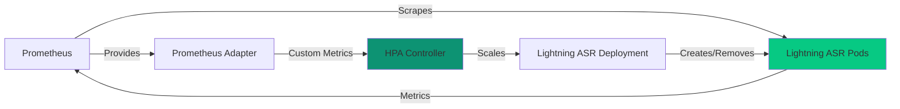

## Overview

Horizontal Pod Autoscaling (HPA) automatically adjusts the number of Lightning ASR and API Server pods based on workload demand. This guide covers configuring HPA using custom metrics like active request count.

## How HPA Works



Lightning ASR exports the `asr_active_requests` metric, which tracks the number of requests currently being processed. HPA uses this to scale pods up or down.

## Prerequisites

<Steps>
  <Step title="Prometheus Stack">
    Install kube-prometheus-stack (included in Helm chart):
    
    ```yaml values.yaml
    scaling:
      auto:
        enabled: true
    
    kube-prometheus-stack:
      prometheus:
        prometheusSpec:
          serviceMonitorSelectorNilUsesHelmValues: false
      prometheusOperator:
        enabled: true
      grafana:
        enabled: true
    ```
  </Step>

  <Step title="Prometheus Adapter">
    Install prometheus-adapter (included in Helm chart):
    
    ```yaml values.yaml
    prometheus-adapter:
      prometheus:
        url: http://smallest-prometheus-stack-prometheus.default.svc
        port: 9090
    ```
  </Step>

  <Step title="Service Monitor">
    Enable ServiceMonitor for Lightning ASR:
    
    ```yaml values.yaml
    scaling:
      auto:
        lightningAsr:
          servicemonitor:
            enabled: true
    ```
  </Step>
</Steps>

## Enable HPA

### Lightning ASR HPA

Configure autoscaling for Lightning ASR based on active requests:

```yaml values.yaml
scaling:
  auto:
    enabled: true
    lightningAsr:
      hpa:
        enabled: true
        minReplicas: 1
        maxReplicas: 10
        targetActiveRequests: 5
        scaleUpStabilizationWindowSeconds: 0
        scaleDownStabilizationWindowSeconds: 300
```

**Parameters**:
- `minReplicas`: Minimum number of pods (never scales below)
- `maxReplicas`: Maximum number of pods (never scales above)
- `targetActiveRequests`: Target active requests per pod (scales when exceeded)
- `scaleUpStabilizationWindowSeconds`: Delay before scaling up (0 = immediate)
- `scaleDownStabilizationWindowSeconds`: Delay before scaling down (prevents flapping)

### API Server HPA

Configure autoscaling for API Server based on Lightning ASR replicas:

```yaml values.yaml
scaling:
  auto:
    enabled: true
    apiServer:
      hpa:
        enabled: true
        minReplicas: 1
        maxReplicas: 10
        lightningAsrToApiServerRatio: 2
        scaleUpStabilizationWindowSeconds: 30
        scaleDownStabilizationWindowSeconds: 60
```

**Parameters**:
- `lightningAsrToApiServerRatio`: Ratio of Lightning ASR to API Server pods (2 = 2 ASR pods per 1 API pod)

## Advanced Scaling Behavior

### Custom Scaling Policies

Fine-tune scaling behavior:

```yaml values.yaml
scaling:
  auto:
    lightningAsr:
      hpa:
        enabled: true
        minReplicas: 2
        maxReplicas: 20
        targetActiveRequests: 5
        behavior:
          scaleUp:
            stabilizationWindowSeconds: 5
            policies:
              - type: Percent
                value: 100
                periodSeconds: 15
              - type: Pods
                value: 2
                periodSeconds: 15
            selectPolicy: Max
          scaleDown:
            stabilizationWindowSeconds: 300
            policies:
              - type: Percent
                value: 50
                periodSeconds: 60
              - type: Pods
                value: 1
                periodSeconds: 60
            selectPolicy: Min
```

**Scale Up Policies**:
- Add up to 100% more pods every 15 seconds
- OR add up to 2 pods every 15 seconds
- Use whichever is higher (`selectPolicy: Max`)

**Scale Down Policies**:
- Remove up to 50% of pods every 60 seconds
- OR remove up to 1 pod every 60 seconds
- Use whichever is lower (`selectPolicy: Min`)

### Multi-Metric HPA

Scale based on multiple metrics:

```yaml
spec:
  metrics:
    - type: Pods
      pods:
        metric:
          name: asr_active_requests
        target:
          type: AverageValue
          averageValue: "5"
    - type: Resource
      resource:
        name: cpu
        target:
          type: Utilization
          averageUtilization: 70
    - type: Resource
      resource:
        name: memory
        target:
          type: Utilization
          averageUtilization: 80
```

## Verify HPA Configuration

### Check HPA Status

```bash
kubectl get hpa -n smallest
```

Expected output:
```
NAME            REFERENCE                TARGETS   MINPODS   MAXPODS   REPLICAS   AGE
lightning-asr   Deployment/lightning-asr   3/5       1         10        2          5m
api-server      Deployment/api-server      2/4       1         10        1          5m
```

### Describe HPA

```bash
kubectl describe hpa lightning-asr -n smallest
```

Look for:
```
Metrics:
  "asr_active_requests" on pods:
    Current: 3
    Target:  5 (average)
Events:
  Normal   SuccessfulRescale   1m    horizontal-pod-autoscaler  New size: 2; reason: pods metric asr_active_requests above target
```

### Check Custom Metrics

Verify prometheus-adapter is providing metrics:

```bash
kubectl get --raw "/apis/custom.metrics.k8s.io/v1beta1" | jq .
```

Should show `asr_active_requests` in the list.

Query specific metric:

```bash
kubectl get --raw "/apis/custom.metrics.k8s.io/v1beta1/namespaces/smallest/pods/*/asr_active_requests" | jq .
```

## Testing HPA

### Load Testing

Generate load to trigger scaling:

```bash
for i in {1..100}; do
  curl -X POST http://api-server.smallest.svc.cluster.local:7100/v1/listen \
    -H "Authorization: Token ${LICENSE_KEY}" \
    -H "Content-Type: application/json" \
    -d '{"url": "https://example.com/test-audio.wav"}' &
done
```

Watch scaling in action:

```bash
kubectl get hpa -n smallest -w
```

### Monitor Pod Count

In another terminal:

```bash
watch -n 2 kubectl get pods -l app=lightning-asr -n smallest
```

You should see:
1. Active requests increase
2. HPA detects load above target
3. New pods created
4. Load distributed across pods
5. After load decreases, pods scale down (after stabilization window)

## Scaling Scenarios

### Scenario 1: Traffic Spike

**Situation**: Sudden increase in requests

**HPA Response**:
1. Detects `asr_active_requests` > 5 per pod
2. Immediately scales up (stabilization: 0s)
3. Adds pods based on policy (2 pods or 100%, whichever is higher)
4. Repeats every 15 seconds until load is distributed

**Configuration**:
```yaml
scaleUpStabilizationWindowSeconds: 0
behavior:
  scaleUp:
    policies:
      - type: Percent
        value: 100
      - type: Pods
        value: 2
    selectPolicy: Max
```

### Scenario 2: Gradual Traffic Decline

**Situation**: Traffic decreases after peak hours

**HPA Response**:
1. Detects `asr_active_requests` < 5 per pod
2. Waits 300 seconds (5 minutes) before scaling down
3. Gradually removes pods (1 pod or 50%, whichever is lower)
4. Prevents premature scale-down

**Configuration**:
```yaml
scaleDownStabilizationWindowSeconds: 300
behavior:
  scaleDown:
    policies:
      - type: Percent
        value: 50
      - type: Pods
        value: 1
    selectPolicy: Min
```

### Scenario 3: Off-Hours

**Situation**: No traffic during night

**HPA Response**:
1. Scales down to `minReplicas: 1`
2. Keeps one pod ready for incoming requests
3. Scales up immediately when traffic resumes

**Configuration**:
```yaml
minReplicas: 1
maxReplicas: 10
```

<Tip>
For complete cost savings during off-hours, use [Cluster Autoscaler](/kubernetes/autoscaling/cluster-autoscaler) to scale nodes to zero.
</Tip>

## Troubleshooting

### HPA Shows "Unknown"

**Symptom**:
```
NAME            TARGETS         MINPODS   MAXPODS
lightning-asr   <unknown>/5     1         10
```

**Diagnosis**:

Check prometheus-adapter logs:

```bash
kubectl logs -n kube-system -l app.kubernetes.io/name=prometheus-adapter
```

Check ServiceMonitor:

```bash
kubectl get servicemonitor -n smallest
kubectl describe servicemonitor lightning-asr -n smallest
```

Check Prometheus is scraping:

```bash
kubectl port-forward -n default svc/smallest-prometheus-stack-prometheus 9090:9090
```

Open http://localhost:9090 and query: `asr_active_requests`

**Solutions**:

1. Ensure ServiceMonitor is created
2. Verify Prometheus is scraping Lightning ASR pods
3. Check prometheus-adapter configuration

### HPA Not Scaling

**Symptom**: Metrics show high load but pods not increasing

**Check**:

```bash
kubectl describe hpa lightning-asr -n smallest
```

Look for events explaining why scaling didn't occur:

```
Events:
  Warning  FailedGetPodsMetric  1m  horizontal-pod-autoscaler  unable to get metric asr_active_requests
```

**Common causes**:
- Metrics not available (see above)
- Already at `maxReplicas`
- Insufficient cluster resources
- Stabilization window preventing scale-up

### Pods Scaling Too Aggressively

**Symptom**: Pods constantly scaling up and down

**Solution**: Increase stabilization windows:

```yaml
scaleUpStabilizationWindowSeconds: 30
scaleDownStabilizationWindowSeconds: 600
```

### Scale-Down Too Slow

**Symptom**: Pods remain after traffic drops

**Solution**: Reduce scale-down stabilization:

```yaml
scaleDownStabilizationWindowSeconds: 120
```

Be careful: too aggressive scale-down causes flapping.

## Best Practices

<AccordionGroup>
  <Accordion title="Set Appropriate Targets" icon="bullseye">
    Choose `targetActiveRequests` based on your model performance:
    
    - Larger models (slower inference): Lower target (e.g., 3)
    - Smaller models (faster inference): Higher target (e.g., 10)
    
    Test with load to find optimal value.
  </Accordion>

  <Accordion title="Use Conservative Scale-Down" icon="shield">
    Scale up quickly, scale down slowly:
    
    ```yaml
    scaleUpStabilizationWindowSeconds: 0
    scaleDownStabilizationWindowSeconds: 300
    ```
    
    Prevents request failures during traffic fluctuations.
  </Accordion>

  <Accordion title="Set Realistic Limits" icon="gauge">
    Consider cluster capacity when setting `maxReplicas`:
    
    ```yaml
    maxReplicas: 10  # If cluster has 10 GPU nodes
    ```
    
    Don't set higher than available GPU resources.
  </Accordion>

  <Accordion title="Monitor HPA Decisions" icon="chart-line">
    Use Grafana to visualize:
    - Current vs target metrics
    - Pod count over time
    - Scale-up/down events
    
    See [Grafana Dashboards](/kubernetes/autoscaling/grafana-dashboards)
  </Accordion>

  <Accordion title="Test Under Load" icon="flask">
    Regularly load test to verify HPA behavior:
    
    ```bash
    kubectl run load-test --image=williamyeh/hey -it --rm -- \
      -z 5m -c 50 http://api-server:7100/health
    ```
  </Accordion>
</AccordionGroup>

## What's Next?

<CardGroup cols={2}>
  <Card title="Cluster Autoscaler" icon="arrows-up-down" href="/kubernetes/autoscaling/cluster-autoscaler">
    Scale cluster nodes automatically
  </Card>

  <Card title="Metrics Setup" icon="chart-bar" href="/kubernetes/autoscaling/metrics-setup">
    Configure Prometheus and custom metrics
  </Card>

  <Card title="Grafana Dashboards" icon="chart-line" href="/kubernetes/autoscaling/grafana-dashboards">
    Visualize metrics and scaling behavior
  </Card>
</CardGroup>

