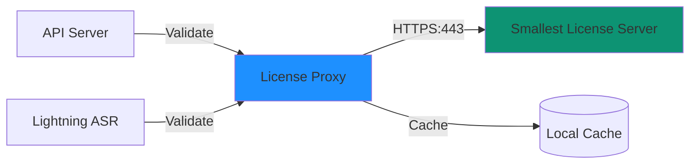

## Overview

The License Proxy validates your Smallest.ai license key and reports usage metadata to Smallest servers. It acts as a gateway for license validation, ensuring all services have valid licensing while maintaining your data privacy.

## Purpose

The License Proxy serves three main functions:

<CardGroup cols={3}>
  <Card title="Validation" icon="check">
    Validates license keys on startup and periodically
  </Card>

  <Card title="Usage Reporting" icon="chart-line">
    Reports metadata (duration, features, response codes) only
  </Card>

  <Card title="Grace Period" icon="clock">
    Provides offline operation during network outages
  </Card>
</CardGroup>

## Architecture



## Configuration

### Basic Setup

The License Proxy is included by default:

```yaml values.yaml
global:
  licenseKey: "your-license-key-here"

licenseProxy:
  namePrefix: license-proxy
  port: 3369
  
scaling:
  replicas:
    licenseProxy: 1
```

### Resource Allocation

License Proxy is lightweight:

```yaml values.yaml
licenseProxy:
  resources:
    limits:
      cpu: 500m
      memory: 512Mi
    requests:
      cpu: 100m
      memory: 256Mi
```

### High Availability

For production, run multiple replicas:

```yaml values.yaml
scaling:
  replicas:
    licenseProxy: 2

licenseProxy:
  affinity:
    podAntiAffinity:
      preferredDuringSchedulingIgnoredDuringExecution:
        - weight: 100
          podAffinityTerm:
            labelSelector:
              matchLabels:
                app: license-proxy
            topologyKey: kubernetes.io/hostname
```

## Network Requirements

### Outbound HTTPS

License Proxy requires outbound access to:

- **Host**: `console-api.smallest.ai`
- **Port**: `443` (HTTPS)
- **Protocol**: HTTPS/TLS 1.2+

<Warning>
Ensure your cluster's network policies, security groups, and firewall rules allow outbound HTTPS traffic.
</Warning>

### Verify Connectivity

Test from within the cluster:

```bash
kubectl run test-connectivity --rm -it --restart=Never \
  --image=curlimages/curl \
  -- curl -v https://console-api.smallest.ai
```

Expected: HTTP 200 or 404 (endpoint exists, but requires valid request)

### Configure Network Policy

Allow License Proxy egress:

```yaml
apiVersion: networking.k8s.io/v1
kind: NetworkPolicy
metadata:
  name: license-proxy-egress
  namespace: smallest
spec:
  podSelector:
    matchLabels:
      app: license-proxy
  policyTypes:
    - Egress
  egress:
    - to:
        - namespaceSelector: {}
      ports:
        - protocol: TCP
          port: 53
    - to:
        - ipBlock:
            cidr: 0.0.0.0/0
      ports:
        - protocol: TCP
          port: 443
```

## Validation Process

### Startup Validation

1. License Proxy starts
2. Reads `LICENSE_KEY` from environment
3. Connects to `console-api.smallest.ai`
4. Validates key and receives terms
5. Caches validation locally
6. Starts serving on port 3369

### Runtime Validation

- API Server and Lightning ASR query License Proxy
- License Proxy checks local cache
- Returns validation status immediately
- Periodically revalidates with Smallest servers

### Grace Period

If connection to Smallest servers fails:

- Uses cached validation (24-hour default)
- Continues serving requests
- Logs warnings
- Automatically retries connection

## Usage Reporting

### Data Reported

License Proxy reports **metadata only**:

| Data | Example | Purpose |
|------|---------|---------|
| Audio duration | 3600 seconds | Billing |
| Request count | 150 requests | Billing |
| Features used | streaming, punctuation | Feature usage tracking |
| Response codes | 200, 400, 500 | Error monitoring |
| Timestamp | 2024-01-15T10:30:00Z | Usage timeline |

<Note>
**No audio or transcript data is transmitted** to Smallest servers. All processing stays within your infrastructure.
</Note>

### Reporting Frequency

- **Batch interval**: Every 5 minutes
- **Max batch size**: 1000 events
- **Retry**: Automatic with exponential backoff

## Monitoring

### Check License Proxy Status

```bash
kubectl get pods -l app=license-proxy -n smallest
```

Expected: `Running` and `1/1 Ready`

### View Logs

```bash
kubectl logs -l app=license-proxy -n smallest -f
```

Successful startup logs:
```
INFO: Starting License Proxy v1.0.0
INFO: License key loaded
INFO: Connecting to console-api.smallest.ai
INFO: License validated successfully
INFO: License valid until: 2025-12-31
INFO: Grace period: 24 hours
INFO: Server listening on port 3369
```

### Health Check

```bash
kubectl exec -it <api-server-pod> -n smallest -- \
  curl http://license-proxy:3369/health
```

Expected response:
```json
{
  "status": "healthy",
  "license_valid": true,
  "valid_until": "2025-12-31T23:59:59Z",
  "grace_period_active": false
}
```

## Troubleshooting

### License Validation Failed

**Symptoms**:
- Error: `License validation failed`
- Pods fail to start
- 401 Unauthorized errors

**Diagnosis**:

Check License Proxy logs:

```bash
kubectl logs -l app=license-proxy -n smallest --tail=50
```

**Common causes**:

<AccordionGroup>
  <Accordion title="Invalid License Key" icon="key">
    **Error**: `Invalid license key`
    
    **Solution**:
    - Verify `licenseKey` in values.yaml is correct
    - Ensure no extra spaces or quotes
    - Contact support@smallest.ai if key is correct but failing
  </Accordion>

  <Accordion title="Expired License" icon="calendar-xmark">
    **Error**: `License expired`
    
    **Solution**:
    - Check expiration date in logs
    - Renew license with Smallest.ai
    - Update `licenseKey` in values.yaml
  </Accordion>

  <Accordion title="Network Connectivity" icon="network-wired">
    **Error**: `Connection refused` or `Timeout`
    
    **Solution**:
    - Test connectivity: `curl https://console-api.smallest.ai`
    - Check firewall/security group rules
    - Verify DNS resolution
    - Check proxy settings if applicable
  </Accordion>

  <Accordion title="Rate Limited" icon="gauge-high">
    **Error**: `Too many requests`
    
    **Solution**:
    - Wait and retry
    - Reduce validation frequency
    - Contact support if persistent
  </Accordion>
</AccordionGroup>

### Grace Period Activated

**Symptoms**:
- Warning: `Using cached validation, grace period active`
- Services still working

**Meaning**: 
License Proxy couldn't reach Smallest servers, using cached validation.

**Actions**:

1. Check network connectivity
2. Monitor grace period expiration
3. Restore connectivity before expiration
4. Services will stop if grace period expires

**Check grace period status**:

```bash
kubectl logs -l app=license-proxy -n smallest | grep -i "grace"
```

### High Memory Usage

**Symptoms**:
- License Proxy pod using excessive memory
- OOMKilled status

**Solution**:

Increase memory limit:

```yaml values.yaml
licenseProxy:
  resources:
    limits:
      memory: 1Gi
```

Check for memory leaks:

```bash
kubectl top pod -l app=license-proxy -n smallest
```

### Connection Refused from Services

**Symptoms**:
- API Server or Lightning ASR can't connect to License Proxy
- Error: `Connection refused: license-proxy:3369`

**Check**:

Verify License Proxy service:

```bash
kubectl get svc license-proxy -n smallest
```

Should show:
```
NAME            TYPE        CLUSTER-IP     PORT(S)
license-proxy   ClusterIP   10.100.1.2     3369/TCP
```

Test connectivity:

```bash
kubectl run test-connection --rm -it --restart=Never \
  --image=curlimages/curl \
  --namespace=smallest \
  -- curl http://license-proxy:3369/health
```

## Security

### Secure License Key Storage

Use Kubernetes secrets instead of plain text:

```bash
kubectl create secret generic license-secret \
  --from-literal=license-key=your-license-key-here \
  --namespace smallest
```

Reference in values:

```yaml values.yaml
global:
  licenseKey: ""
  licenseKeySecretRef: "license-secret"
```

### Network Isolation

Restrict access to License Proxy:

```yaml
apiVersion: networking.k8s.io/v1
kind: NetworkPolicy
metadata:
  name: license-proxy-ingress
  namespace: smallest
spec:
  podSelector:
    matchLabels:
      app: license-proxy
  policyTypes:
    - Ingress
  ingress:
    - from:
        - podSelector:
            matchLabels:
              app: api-server
        - podSelector:
            matchLabels:
              app: lightning-asr
      ports:
        - protocol: TCP
          port: 3369
```

### TLS Configuration

Enable TLS for internal communication:

```yaml values.yaml
licenseProxy:
  tls:
    enabled: true
    certSecretName: "license-proxy-tls"
```

## Best Practices

<AccordionGroup>
  <Accordion title="Always Use High Availability" icon="clone">
    Run at least 2 License Proxy replicas in production:
    
    ```yaml
    scaling:
      replicas:
        licenseProxy: 2
    ```
  </Accordion>

  <Accordion title="Monitor Grace Period" icon="bell">
    Set up alerts for grace period activation:
    
    ```promql
    license_proxy_grace_period_active == 1
    ```
  </Accordion>

  <Accordion title="Secure License Keys" icon="lock">
    Never commit license keys to version control:
    
    - Use Kubernetes secrets
    - Use external secret managers (AWS Secrets Manager, Vault)
  </Accordion>

  <Accordion title="Test Network Connectivity" icon="network-wired">
    Regularly test connectivity to Smallest servers:
    
    ```bash
    kubectl run connectivity-test --rm -it --restart=Never \
      --image=curlimages/curl \
      -- curl -v https://console-api.smallest.ai
    ```
  </Accordion>

  <Accordion title="Review Logs" icon="file-lines">
    Periodically review License Proxy logs for:
    
    - Validation failures
    - Network errors
    - Grace period activations
  </Accordion>
</AccordionGroup>

## What's Next?

<CardGroup cols={2}>
  <Card title="Kubernetes Troubleshooting" icon="wrench" href="/kubernetes/k8s-troubleshooting">
    Debug common Kubernetes deployment issues
  </Card>

  <Card title="API Reference" icon="code" href="/api-reference/authentication">
    Integrate with your applications
  </Card>
</CardGroup>

